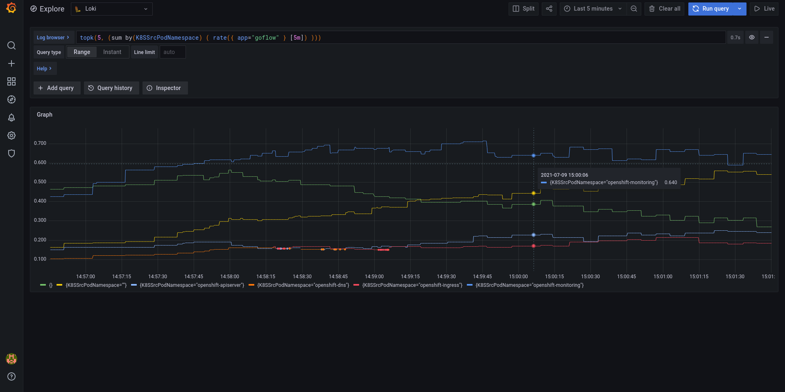

## Loki / promtail on ocp4 with helm charts

```bash
helm repo add grafana https://grafana.github.io/helm-charts
helm repo update
helm upgrade --install loki grafana/loki-stack
oc apply -f ./clusterrole.yaml

# Add "privileged: true" to container securityContext
oc edit daemonset loki-promtail
```

```yaml
          securityContext:
            # ...
            privileged: true
```

### Setup with goflow

Follow steps at https://github.com/jotak/goflow/blob/enrich_k8s/PoC.md#upstream-ovn-kubernetes

The following config map will track only goflow, a set up a pipeline for indexing src/dest

```bash
oc apply -f ./loki-promtail-cm-goflow.yaml
oc delete pods -l app=promtail
```

### Check promtail & goflow

- Locate which promtail pod tracks goflow, e.g. `oc get pods -o wide` and locate the promtail instance that runs on the same node.

Then, port-forward on 3101 and open http://localhost:3101/targets

E.g.
```bash
oc port-forward loki-promtail-jqlmh 3101
```

## Check Grafana

See also https://grafana.com/docs/loki/latest/installation/helm/#deploy-grafana-to-your-cluster

```bash
helm install loki-grafana grafana/grafana
oc get secret loki-grafana -o jsonpath="{.data.admin-password}" | base64 --decode ; echo
oc port-forward svc/loki-grafana 3000:80
```

Open http://localhost:3000/
Login with admin + printed password
Add datasource => Loki => http://loki:3100/


_Top namespaces:_ `topk(5, (sum by(K8SSrcPodNamespace) ( rate({ app="goflow" } [5m]) )))`

## Other reads/stuff

See also:
`helm template promtail /work/grafana-helm-charts/charts/promtail --set rbac.privilegedSCC=true --set containerSecurityContext.privileged=true --set containerSecurityContext.allowPrivilegeEscalation=true > promtail.yaml`


To read:
https://grafana.com/blog/2019/07/25/lokis-path-to-ga-adding-structure-to-unstructured-logs/

https://grafana.com/blog/2020/08/27/the-concise-guide-to-labels-in-loki/

## Loki + promtail with ovn-kubernetes (kind)

For goflow setup, follow steps at https://github.com/jotak/goflow/blob/enrich_k8s/PoC.md#upstream-ovn-kubernetes

```bash
helm upgrade --install loki grafana/loki-stack
kubectl apply -f ./clusterrole.yaml
kubectl apply -f ./loki-promtail-cm-goflow.yaml
kubectl delete pods -l app=promtail
```

To check in Grafana (and install it), follow the same instructions as for ocp.

### Troubleshooting, inotify

If promtail never gets ready, check its logs, could be an issue with max number of watched files. If so:

```bash
sysctl fs.inotify
```

```
fs.inotify.max_queued_events = 16384
fs.inotify.max_user_instances = 128
fs.inotify.max_user_watches = 524288
```

=> max_user_instances might be too low, update it:

```bash
sudo sysctl -n -w fs.inotify.max_user_instances=512
```

### promtail still not ready?

Note, promtail won't show as ready until it was able to scrape some logs. So maybe it's just that there's no available target.

To check targets, port-forward a promtail instance on 3101 then open http://localhost:3101/targets

E.g.
```bash
kubectl port-forward loki-promtail-jqlmh 3101
```

If you're on the instance that watches goflow, you should see an entry for it.


## Alternative

See Eran: https://github.com/eranra/lokideploy
It's a deployment script also based on helm charts.

## Testing promtail pipelines

Download promtail binary (e.g. https://github.com/grafana/loki/releases/download/v2.1.0/promtail-linux-amd64.zip )
Then:

```bash
cat sample-single-netflow | promtail --stdin --dry-run --client.url http://whatever --config.file test-config.yaml

# or (if json embedded in log format):
cat sample-single-netflow-2 | promtail --stdin --dry-run --client.url http://whatever --config.file test-config.yaml
```
